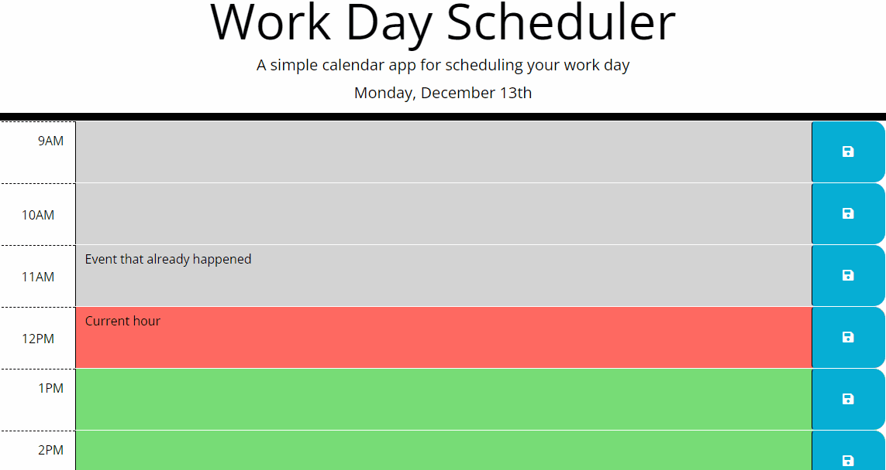

# WorkdaySchedule
A 9am-5pm hourly workday daily planner.

## Description
This web application will allow you to fill out a task for every hour of your 9-5 workday.
Use your web browser to track your daily schedule!

Every hour will be marked either grey, red, or green. 
The present/current hour will show up in red, this is your current task
The past/prevous hours will show up in grey, these tasks are done or must be moved on from
The future/upcoming hours will show up in green, these are hours you still have and tasks that are coming up next.

Today's date will be at the top of the page, you can also clear the entire page using the 'clear button' when you want to start fresh (please note, this will clear all history)

You can now manage your time efficiently by scheduling your tasks and chasing down the hourly timer. 


## Technologies

- Git Hub
- Html
- Css
- Javascript
- JQuery v3.7.1
- DayJS v1.11.10
- Bootstrap v5.1.3
- Font Awesome v5.8.1
- Google Api Fonts

This application was an activity in allowing me to explore the application of jquery and day js

## Visuals



## Installation

Website has been deployed and is available from this link:

[Workday Schedule - Daily Planner Website](https://alexandranel.github.io/WorkdaySchedule/)

Full repository can be accessed here:

[Git Repository](https://github.com/AlexandraNel/WorkdaySchedule)

``````
To view repo contents please navigate to the above link there you will find
- assets folder
    - gif
    - License
    - script.js
    - Style.css
- README.md
- index.html

``````

## Usage

This website was constructed in an effort to improve jquery and dayjs knowledge
Its usage is of a simple 9-5, daily scheduler.

## Support

If you come into any issues with this web application please contact
info@alexandranel.com

## Roadmap

Moving forward the following improvements can be made

- Design can be imrpoved by extending the css stylesheets
- Daily tasks can be saved to a server in order to retrieve yearly progress reports

## Authors and Acknowledgment

This website was made under the guidance and with assistance from
- the team at MONASH UNI full Stack Dev Bootcamp
- Instructor Chee Ho Tai
- TA Pranita Shrestha
- Tutor Weng Fei Fung 

## Licence
MIT License
